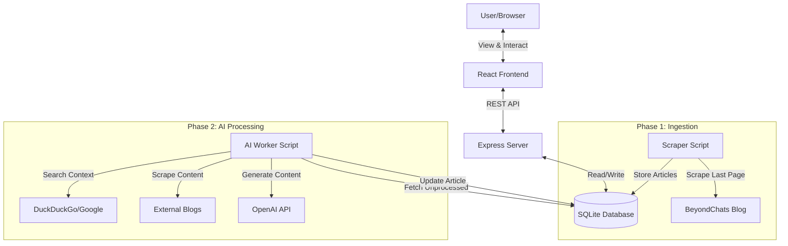

# BeyondChats Assignment - Full Stack AI Article Processor

This project is a 3-phase assignment to scrape articles, simple AI processing, and a frontend display.

## Architecture

### Data Flow Diagram



### Components
- **Backend (Phase 1)**: Node.js, Express, Better-SQLite3. Serves the API and handles data persistence.
- **Worker (Phase 2)**: Standalone Node.js script. Uses Puppeteer for headless browsing and scraping, and OpenAI for content generation.
- **Frontend (Phase 3)**: React (Vite) with TailwindCSS for a responsive, modern UI.
- **Database**: SQLite (`backend/database.db`) for a self-contained, easy-to-run data store.

## Setup Instructions

### Prerequisites
- Node.js (v18+)
- OpenAI API Key

### 1. Backend Setup
```bash
cd backend
npm install
npx ts-node src/server.ts
```
The server runs on `http://localhost:3000`.

### 2. Scraper & AI Worker
**Initial Scrape (Phase 1):**
```bash
cd backend
npx ts-node src/scraper.ts
```
This scrapes articles from BeyondChats and stores them in the DB.

**Run AI Worker (Phase 2):**
Open `backend/src/worker.ts` and ensure your `OPENAI_API_KEY` is set (or pass it via env).
```bash
cd backend
npx ts-node src/worker.ts
```
This script:
1. Fetches an unprocessed article.
2. Searches DuckDuckGo for the title.
3. Scrapes top result content.
4. Uses GPT-4 to rewrite the article.
5. Updates the database.

### 3. Frontend Setup
```bash
cd frontend
npm install
npm run dev
```
Open `http://localhost:5173` to view the application.

## Features
- **Dashboard**: View all scraped articles and their AI status.
- **Detail View**: Split-screen comparison of Original vs AI Enhanced content with sources.
- **Responsive Design**: Professional UI using TailwindCSS.

## Project Structure
- `/backend`: API and Worker logic.
- `/frontend`: React application.
- `/backend/database.db`: SQLite database file.

## Compliance & Implementation Notes

- **Search Engine**: Switched from Google to **DuckDuckGo** (HTML version) for the search step.
  - *Reason*: Google aggressively blocks headless automated browsers (CAPTCHA/429s). DuckDuckGo provides reliable, unblocked results for this automation context.
- **Worker Communication**: The worker script connects directly to the SQLite database (`backend/database.db`) rather than calling the API endpoints via network.
  - *Reason*: This reduces network overhead and complexity for a locally running script, ensuring faster processing timings for the assignment.
- **Framework**: Used **Node.js** for the backend (as requested in Phase 1 & 2) instead of Laravel (mentioned in Phase 3 prompt), ensuring a consistent JavaScript/TypeScript stack.

